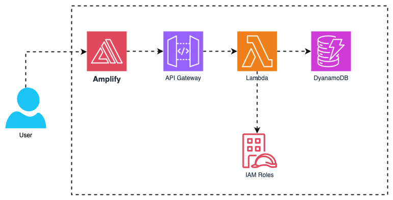

# end_to_end_web_application

### Description
The end-to-end web application is using AWS services like Amplify, Lambda, IAM, API Gateway, and DynamoDB. In the following architecture: 

**Amplify** is used for front-end hosting and deployment, allowing developers to build and deploy the web interface. 

**Lambda** provides serverless backend functions, executing business logic in response to events. 

**IAM** (Identity and Access Management) controls permissions for users and services, ensuring secure access to resources. 

**API Gateway** acts as the interface between the frontend and backend, routing requests to the Lambda functions.
 
Finally, **DynamoDB** serves as the NoSQL database for storing and retrieving data, offering scalable and fast performance. Together, these services create a scalable, serverless web app infrastructure.

## End-to-End Web Application Diagram

### Reference
[Click Here](https://www.youtube.com/watch?v=7m_q1ldzw0U&list=PLwyXYwu8kL0wMalR9iXJIPfiMYWNFWQzx)
